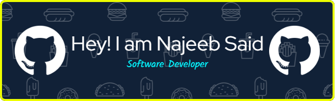

# 

- 🔗 **Portfolio & case studies**: [njbsyd.dev](https://njbsyd.dev)
- 📱 **Lead Mobile App Engineer** — building a production consumer app in **React Native** on the New Architecture.
- 💻 **Lead Full-Stack Engineer** — building a **Next.js/Supabase** learning platform: PostgreSQL schema design, access control, and billing.
- ⚙️ Backends in **Node.js** (Express, AdonisJS) over **PostgreSQL** — schemas, row-level security, payments, and worker queues.
- 🌐 Web frontends in **Next.js** and **React**, from static exports to server-rendered apps.
- 🦀 When I want to understand something properly, I build it from first principles — most recently storage engines in **Rust**: B-trees, write-ahead logs, crash recovery.
- 🎓 BS in Software Engineering, COMSATS University Islamabad (Abbottabad Campus).

_The work above is written up properly — problems, decisions, outcomes — at [njbsyd.dev](https://njbsyd.dev)._

 

# 🛠️ Working with

&nbsp;
&nbsp;
&nbsp;
&nbsp;
&nbsp;
&nbsp;
&nbsp;
&nbsp;
&nbsp;
&nbsp;
&nbsp;
&nbsp;

 

# Connect with me 

